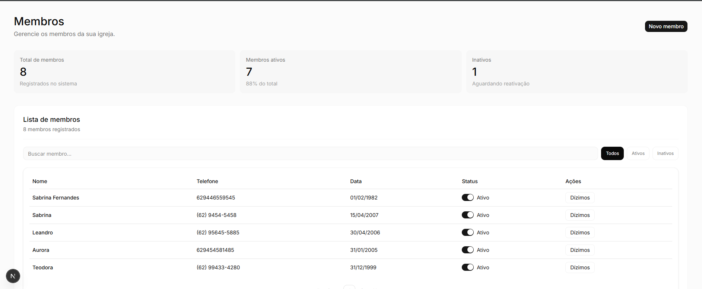
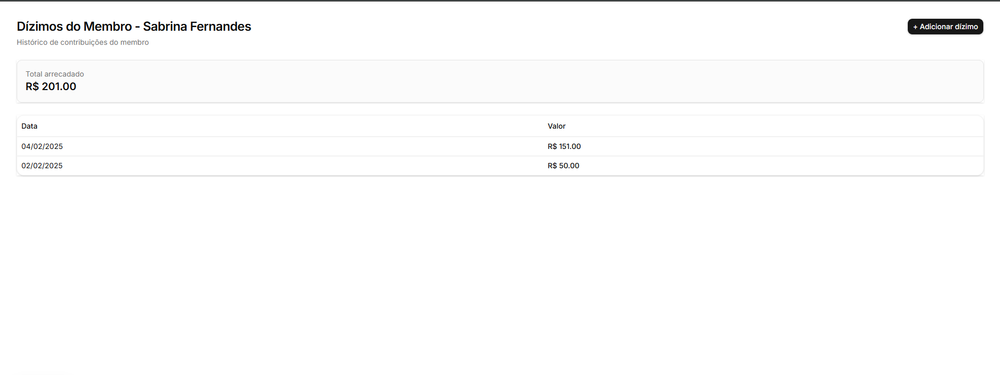

# Plenno — Sistema de Gestão para Igrejas

Sistema web para gestão de membros e controle de dízimos, desenvolvido como desafio técnico.  
O objetivo é centralizar informações de membros e registrar contribuições financeiras de forma simples, rápida e organizada.

---

## Telas do Sistema

### Tela de Membros

Interface de listagem e gerenciamento de membros.



**Funcionalidades visíveis:**
- Listagem paginada
- Status ativo/inativo
- Acesso aos dízimos por membro

---

### Tela de Dízimos

Interface de registro e visualização dos dízimos por membro.



**Funcionalidades visíveis:**
- Registro de novos dízimos
- Listagem histórica
- Cálculo de total arrecadado por membro

## Funcionalidades

### Gestão de Membros
- Cadastro de membros (nome, telefone, data de nascimento, status ativo/inativo)
- Listagem com paginação
- Filtro por status
- Atualização de status em tempo real
- Navegação para detalhes do membro

### Gestão de Dízimos
- Registro de dízimos por membro (valor + data)
- Listagem completa de dízimos
- Cálculo de total acumulado por membro
- Histórico ordenado por data (mais recente primeiro)

###  Interface
- Layout moderno utilizando shadcn/ui
- Componentes reutilizáveis
- Tabelas responsivas
- Modais para criação de registros

---

## Tecnologias Utilizadas

- Next.js (App Router)
- React
- TypeScript
- Supabase (PostgreSQL + API)
- TailwindCSS
- shadcn/ui
- date-fns

---

## Banco de Dados (Supabase)

### Tabela `members`

```sql
id uuid
name text
phone text
birth_date date
status boolean
created_at timestamp
```

### Tabela `tithes`
```sql
id uuid
member_id uuid
amount numeric
date date
created_at timestamp
```
## 🔄 Fluxos do Sistema

### Cadastro de membro
- Usuário cadastra um novo membro  
- Lista atualiza automaticamente  
- Novo membro aparece no topo  

### Registro de dízimo
- Usuário abre página do membro  
- Adiciona valor e data  
- Sistema atualiza lista e total automaticamente  

---

## Rotas

- `/members` → lista de membros  
- `/members/[id]/tithes` → gestão de dízimos por membro  

---

## Como rodar o projeto

```bash
pnpm install
pnpm dev
```

## Variáveis de ambiente

Crie um arquivo .env.local:
```bash
NEXT_PUBLIC_SUPABASE_URL=...
NEXT_PUBLIC_SUPABASE_ANON_KEY=...
```

## Autora
Vitória Luz Alves D' Abadia
